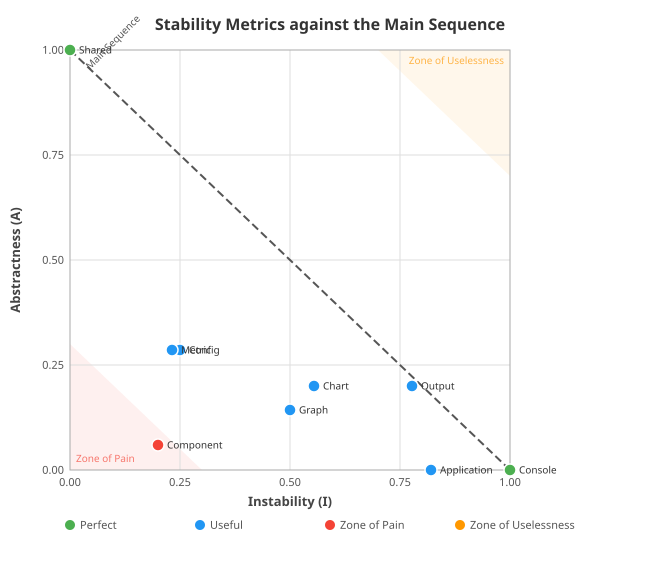
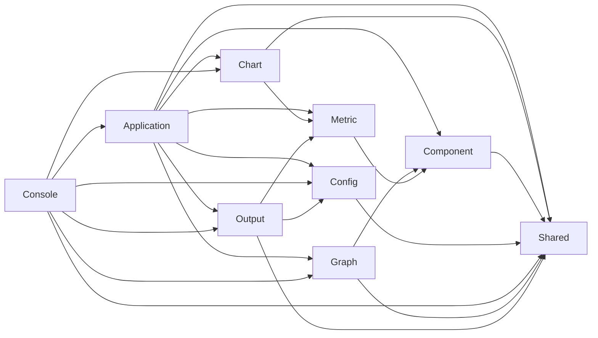

# Stability
#### PHP Stable Dependency Metrics Analyser



## Overview

**_Stability_** is a PHP-based tool designed to analyse and calculate the stability of software components
in your architecture.

It leverages clean architecture principles and stable dependency metrics to provide insights into the maintainability
and robustness of your codebase.

Stability is a nod to the [Stable Dependency Principle](CLEAN_ARCHITECTURE.md#2-stable-dependencies-principle-sdp)
and the [Stable Dependency Metrics](#stable-dependency-metrics), where we are actually measuring **_Instability_**.

The goal is to identify components that are either too abstract or too unstable.

### Why use Stability?

Stability can help you identify components that are either overly complex (too abstract)
or too tightly coupled (too unstable).

By monitoring the metrics of your components as your project continues to develop,
you can detect areas in your codebase / architecture that may need refactoring early on.

This can help you improve the maintainability and robustness of your codebase,
while also making it easier to understand.
These metrics can also be used to guide your development process, and to convince stakeholders of the need for 
improvement.

## Installation

To install the package, use Composer to include it as a dev-dependency:

```bash
composer require --dev jcvviljoen/stability
```

## Usage

To calculate the stability of your components, run the following command:

```bash
php vendor/bin/stability
```

Various arguments are also supported (don't worry, any invalid setup will guide you through the process anyway):

- `-i, --init`: Initialize the configuration file
- `--config`: Specify a custom configuration file / path
- `--output`: Set the output format, either `console` (default) or `json`
- `--output-path`: The directory to write output files to, relative to the project's base path
- `--output-name`: The name of the output file (_defaults to `stability-result`_)
- `--with-graph`: Also render a dependency graph, either `mermaid` or `dot`
- `--with-chart`: Also render a stability chart, currently only `svg`
- `--fail-on-cycles`: Exit with a failure when a circular dependency is found, for use in a build
- `--debug`: Enable debug output (exposes exception stack traces)

The command is built on Symfony Console, so `--help`, `-q`, `-v` and the other standard
options come with it.

For example, you can specify a custom configuration file (as long as it is a supported format):

```bash
php vendor/bin/stability --config "path/to/config.php"
```

### Visualising the results

Both visuals are written next to your results, in `--output-path` when you set one and the current
directory when you don't:

```bash
php vendor/bin/stability --with-graph mermaid --with-chart svg
```

The dependency graph (`stability-graph.mmd`) shows each component and the direction of its
dependencies, with any component caught in a circular dependency coloured red. Cycles are
listed in the console output of every run, whether you ask for a graph or not, so you can see
which ones to break apart first.

You get a pair of components that import each other as the lap they make, since that lap is the
thing to break. A bigger knot comes out as a list of its members instead. Every component in a
knot can reach every other one, but not in the order they happen to be listed, so arrows between
them would claim a route that may not exist.

Mermaid files render on GitHub inside a fenced `mermaid` block. The `dot` renderer writes Graphviz instead, which you can
convert yourself:

```bash
dot -Tsvg stability-graph.dot -o stability-graph.svg
```

The stability chart (`stability-chart.svg`) plots each component at its abstractness and instability,
with the main sequence drawn as a diagonal. Dots are coloured by zone, and hovering over one shows
the component's name and its metrics. The shaded corners mark where a component crosses into a zone
at the default threshold, which is what the image at the top of this file shows.

Here is what the graph looks like for this project:


```mermaid
graph LR
    Application
    Chart
    Component
    Config
    Console
    node_Graph["Graph"]
    Metric
    Output
    Shared
    Application --> Chart
    Application --> Component
    Application --> Config
    Application --> node_Graph
    Application --> Metric
    Application --> Output
    Application --> Shared
    Chart --> Metric
    Chart --> Shared
    Component --> Shared
    Config --> Shared
    Console --> Application
    Console --> Chart
    Console --> Config
    Console --> node_Graph
    Console --> Output
    Console --> Shared
    node_Graph --> Component
    node_Graph --> Shared
    Metric --> Component
    Output --> Config
    Output --> Metric
    Output --> Shared
```

Two shapes are worth pointing out. `Application` and `Console` are what Robert Martin calls
Main: they depend on everything and nothing depends on them, so they carry an instability of
1 or close to it. That is where the translation from configuration into components lives,
which is what lets `Component` and `Config` stay ignorant of each other.

`Shared` is the opposite end. It holds one abstract class, the exception every other one
extends, so everything depends on it and it depends on nothing. That gives it A = 1.00 and
I = 0.00, which puts it exactly on the main sequence. It has a component to itself precisely
so that it can be depended on from everywhere without closing a cycle.

This is not a claim you have to take on trust. The configuration in
[stability.php](stability.php) covers every directory under `src`, and `composer tests` runs
`stability --fail-on-cycles` against it, so a pull request that introduces a cycle between
these components fails its build.

### Configuration fields

There are various configuration fields that you can use to customise the analysis,
all of which is explained in the [sample configuration file](stability.php.sample).

You can do the following:
- Specify the main application source to scan.
- Define the components within the application you want to analyse.
- For each component, you can also:
  - Exclude specific files / directories from being scanned.
  - Threshold for crossing into the zone of pain (_defaults to 0.7 when not specified_).
  - Threshold for crossing into the zone of uselessness (_defaults to 0.7 when not specified_).

### Be Creative

You don't have to restrict yourself to only one application source.
You can also analyse your project at a higher (or lower) level of granularity!

**For example**, let's consider a modular monolith. You can:
- Analyse the entire application to see how the modules interact;
- Analyse each module to see how the layers within the module interact; or
- Analyse a domain within a layer to see how the classes within the domain interact.

Should you find something interesting or would like to analyse something specific,
please share or contribute!

## Features

- **Component Parsing**: Parses class and modules into components as specified by your configuration.
- **Stability Calculation**: Computes metrics such as abstractness, instability, and distance from the main sequence (DMS).
- **Output Results**: Outputs the calculated stability results for further ( _manual*_ ) analysis.
- **Dependency Graph**: Renders the dependencies between components, and detects circular dependencies.
- **Stability Chart**: Plots the components against the main sequence to show where each one sits.

\* See the [Roadmap](ROADMAP.md) for potential future features.

## Stable Dependency Metrics

Stability uses the following metrics to evaluate the stability of components:

**Abstractness (A)**

Measures the ratio of abstract classes and interfaces to the total number of classes.
A higher value indicates more abstract components.

**Instability (I)**

Measures the ratio of outgoing dependencies to the total number of dependencies.
A higher value indicates more unstable components
(i.e. components that are hard to change due to their high number of dependencies).

**Distance from the Main Sequence (DMS)**

Combines abstractness and instability to determine how far
a component is from the ideal balance of being abstract and stable.

### Reading a bad score honestly

The chart at the top of this file puts one of Stability's own components, `Component`, in
the Zone of Pain. That is not an oversight, and it is worth explaining, because you will
meet the same reading in your own projects.

`Component` is the domain core here. Plenty depends on it, it depends on almost nothing, and
it is made of concrete classes. By the Stable Abstractions Principle that is exactly the
combination the metric is built to flag: something this stable should be abstract, so that
it can be extended without being modified.

Martin's own answer is that the corner has legitimate residents. His example is a string
library: highly stable, entirely concrete, and nothing to worry about, because it is not
volatile. The question the metric asks is not "is this concrete and stable?" but "is this
concrete, stable, and likely to change?". A domain core made of value objects and entities
answers yes to the first and no to the second.

So use the number as a prompt, not a verdict. Where a stable concrete component does turn
out to be volatile, the metric has found something real. Where it does not, write down why,
and move on. What is worth failing a build over is a cycle, because there is no reading of
the Acyclic Dependencies Principle under which one is fine.

You can read more about the principles being applied in the [CLEAN_ARCHITECTURE](CLEAN_ARCHITECTURE.md) file.

## Contributing

Contributions are welcome!

Please see the [CONTRIBUTING](.github/CONTRIBUTING.md) file for more information.

## License

This project is licensed under the MIT License. See the [LICENSE](LICENSE) file for details.

## Credits & References

This project is largely inspired by the work of [Robert C. Martin](https://en.wikipedia.org/wiki/Robert_C._Martin),
who introduced the concept of stable dependency metrics in his book "[Clean Architecture](https://www.google.nl/books/edition/Clean_Architecture/uGE1DwAAQBAJ?hl=en)".

Also, shout out to [Sergio Rodríguez](https://github.com/serodriguez68) for a good summary of the book
that can be found [here](https://github.com/serodriguez68/clean-architecture).

And lastly, thanks to [Thiago Cordeiro](https://github.com/thiagocordeiro) for his mentorship and guidance
in the development of this project.
