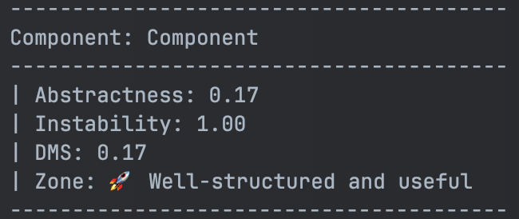

# Stability
#### PHP Stable Dependency Metrics Analyser



## Overview

**_Stability_** is a PHP-based tool designed to analyse and calculate the stability of software components
in your architecture.

It leverages clean architecture principles and stable dependency metrics to provide insights into the maintainability
and robustness of your codebase.

Stability is a nod to the [Stable Dependency Principle](CLEAN_ARCHITECTURE.md#2-stable-dependencies-principle-sdp)
and the [Stable Dependency Metrics](#stable-dependency-metrics), where we are actually measuring **_Instability_**.

The goal is to identify components that are either too abstract or too unstable.

### Why use Stability?

Stability can help you identify components that are either overly complex (too abstract)
or too tightly coupled (too unstable).

By monitoring the metrics of your components as your project continues to develop,
you can detect areas in your codebase / architecture that may need refactoring early on.

This can help you improve the maintainability and robustness of your codebase,
while also making it easier to understand.
These metrics can also be used to guide your development process, and to convince stakeholders of the need for 
improvement.

## Installation

To install the package, use Composer to include it as a dev-dependency:

```bash
composer require --dev jcvviljoen/stability
```

## Usage

To calculate the stability of your components, run the following command:

```bash
php vendor/bin/stability
```

Various arguments are also supported (don't worry, any invalid setup will guide you through the process anyway):

- `-i, --init`: Initialize the configuration file
- `--config`: Specify a custom configuration file / path
- `--debug`: Enable debug output (exposes exception stack traces)

For example, you can specify a custom configuration file (as long as it is a supported format):

```bash
php vendor/bin/stability --config "path/to/config.php"
```

### Configuration fields

There are various configuration fields that you can use to customise the analysis,
all of which is explained in the [sample configuration file](stability.php.sample).

You can do the following:
- Specify the main application source to scan.
- Define the components within the application you want to analyse.
- For each component, you can also:
  - Exclude specific files / directories from being scanned.
  - Threshold for crossing into the zone of pain (_defaults to 0.7 when not specified_).
  - Threshold for crossing into the zone of uselessness (_defaults to 0.7 when not specified_).

### Be Creative

You don't have to restrict yourself to only one application source.
You can also analyse your project at a higher (or lower) level of granularity!

**For example**, let's consider a modular monolith. You can:
- Analyse the entire application to see how the modules interact;
- Analyse each module to see how the layers within the module interact; or
- Analyse a domain within a layer to see how the classes within the domain interact.

Should you find something interesting or would like to analyse something specific,
please share or contribute!

## Features

- **Component Parsing**: Parses class and modules into components as specified by your configuration.
- **Stability Calculation**: Computes metrics such as abstractness, instability, and distance from the main sequence (DMS).
- **Output Results**: Outputs the calculated stability results for further ( _manual*_ ) analysis.

\* See the [Roadmap](ROADMAP.md) for potential future features.

## Stable Dependency Metrics

Stability uses the following metrics to evaluate the stability of components:

**Abstractness (A)**

Measures the ratio of abstract classes and interfaces to the total number of classes.
A higher value indicates more abstract components.

**Instability (I)**

Measures the ratio of outgoing dependencies to the total number of dependencies.
A higher value indicates more unstable components
(i.e. components that are hard to change due to their high number of dependencies).

**Distance from the Main Sequence (DMS)**

Combines abstractness and instability to determine how far
a component is from the ideal balance of being abstract and stable.

You can read more about the principles being applied in the [CLEAN_ARCHITECTURE](CLEAN_ARCHITECTURE.md) file.

## Contributing

Contributions are welcome!

Please see the [CONTRIBUTING](.github/CONTRIBUTING.md) file for more information.

## License

This project is licensed under the MIT License — see the [LICENSE](LICENSE) file for details.

## Credits & References

This project is largely inspired by the work of [Robert C. Martin](https://en.wikipedia.org/wiki/Robert_C._Martin),
who introduced the concept of stable dependency metrics in his book "[Clean Architecture](https://www.google.nl/books/edition/Clean_Architecture/uGE1DwAAQBAJ?hl=en)".

Also, shout out to [Sergio Rodríguez](https://github.com/serodriguez68) for a good summary of the book
that can be found [here](https://github.com/serodriguez68/clean-architecture).

And lastly, thanks to [Thiago Cordeiro](https://github.com/thiagocordeiro) for his mentorship and guidance
in the development of this project.
